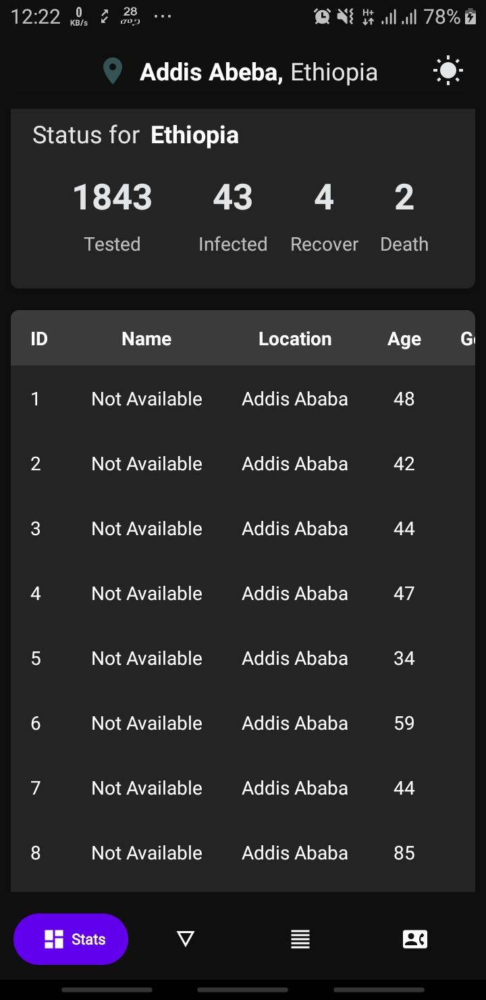
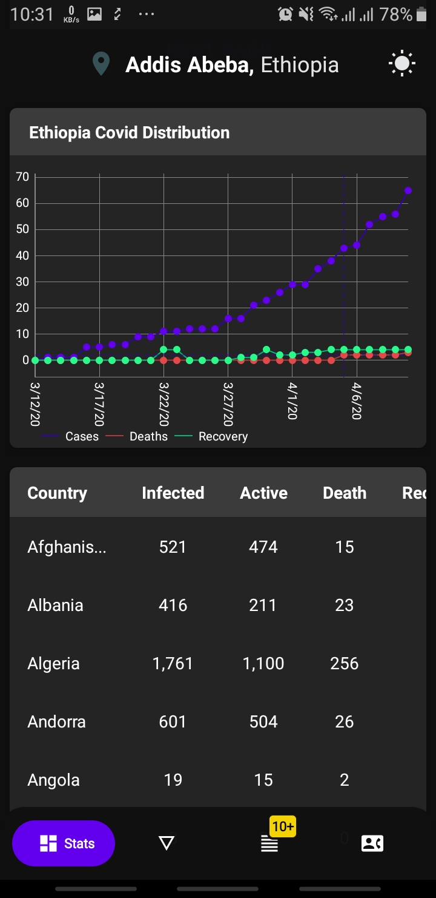
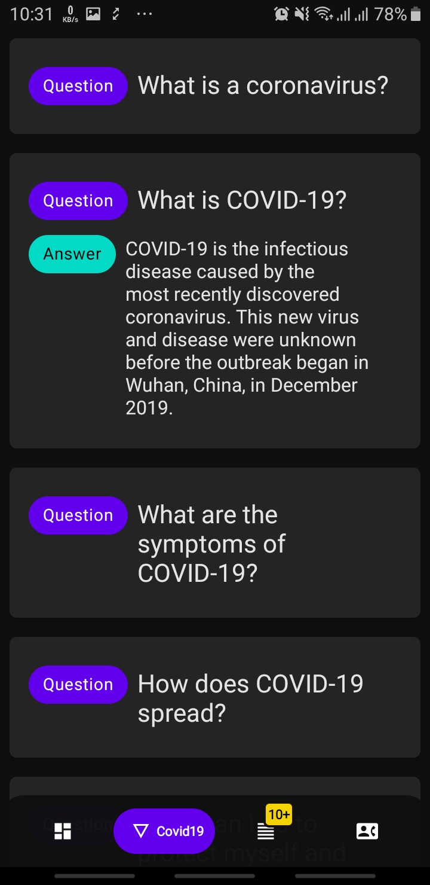
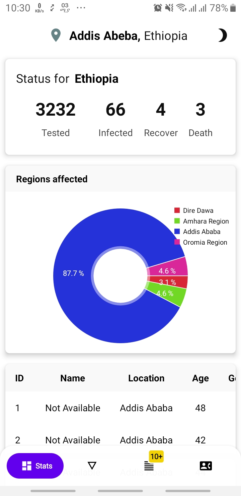
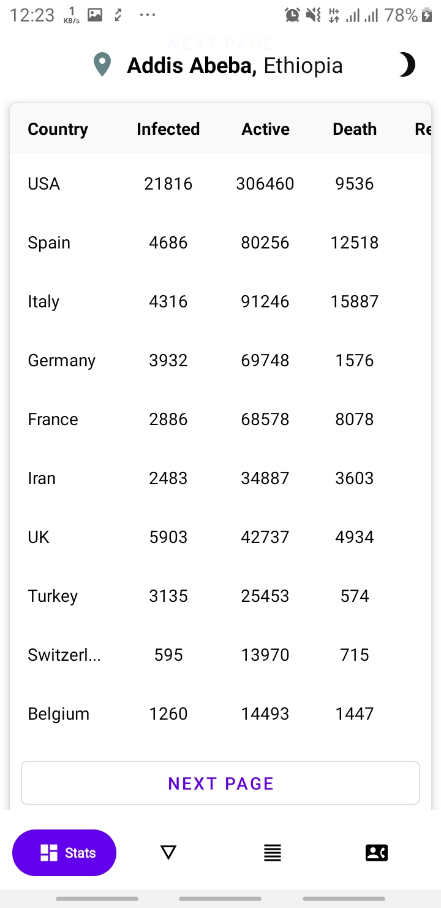
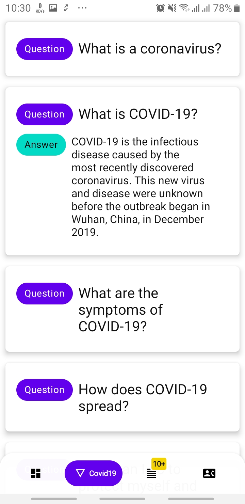

# CovidAndroid
`Android application for tracking and getting informed about the COVID19 virus`

# Screenshots
<p align="center">
<table border="1">
<tr>
<td></td>
<td></td>
<td></td>
<td></td>
<td></td>
<td></td>
</tr>
<tr>
<td><p align="center">Dark - Current cases and affected regions from PMO API</p></td>
<td><p align="center">Dark - Current cases worldwide and historical data</p></td>
<td><p align="center">Dark - FAQs about COVID19 from WHO website</p></td>
<td><p align="center">Light - Current cases and affected regions from PMO API</p></td>
<td><p align="center">Light - Current cases worldwide and historical data</p></td>
<td><p align="center">Light - FAQs about COVID19 from WHO website</p></td>
</tr>
</table>

## Features

* [X] Statistics on COVID19
* [X] Readable contents about the virus
* [ ] News about COVID19 from valid sources
* [ ] Questionnaire to check how you are feeling
* [ ] SOS button for calling ambulance

## Contribution

* You can join the trello board made for managing this project using the link https://trello.com/b/4dE9nqno

* Fork the repo
* Checkout the `dev` branch ‼
* Create a new branch `git checkout -b 'feat/$feature_name'`
* Open a pull request to `dev` branch of this repo

## License
```
Copyright (C) 2020 Brook Mezgebu

Licensed under the Apache License, Version 2.0 (the "License");
you may not use this file except in compliance with the License.
You may obtain a copy of the License at

	http://www.apache.org/licenses/LICENSE-2.0

Unless required by applicable law or agreed to in writing, software
distributed under the License is distributed on an "AS IS" BASIS,
WITHOUT WARRANTIES OR CONDITIONS OF ANY KIND, either express or implied.
See the License for the specific language governing permissions and
limitations under the License.
```
